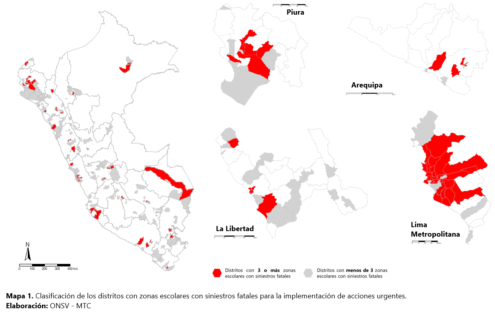

 

## Entornos Escolares Seguros Perú: Siniestralidad vial y proximidad a locales educativos

### [Documento de Trabajo 002](https://www.onsv.gob.pe:5000/siniestralidad-vial-e-infraestructura-segura-en-entornos-escolares/) del Observatorio Nacional de Seguridad Vial (ONSV)

## Resumen
Desde el MTC, la Dirección de Seguridad Vial promovió en el año 2022 el programa “Entornos Escolares Seguros”, con el objetivo de mejorar la seguridad
vial alrededor de locales educativos en el marco del Decreto Supremo
N° 025-2021-MTC. Como parte de este proyecto se realizó una intervención
piloto en la I.E. María Negrón Ugarte de Trujillo que benefició a 1200 alumnas.
Esta iniciativa representa un hito de trabajo en articulación con Transportes
Metropolitanos de Trujillo, la Municipalidad Provincial de Trujillo y el apoyo de la
empresa 3M.
  
A partir de esta experiencia, este tipo de proyectos se ha consolidado como un
servicio dentro de la Política Nacional Multisectorial de Seguridad Vial 2023 –
2030 (PNMSV), lo cual ha permitido iniciar su escalabilidad a nivel nacional en el
presente año. En específico, este servicio S 4.1.3. Asistencia para el diseño de
proyectos de Entornos Escolares Seguros, fiable para gobiernos locales está
alineado con el Objetivo Prioritario 4 de la PNMSV de Lograr las velocidades
seguras para la protección de las y los usuarios viales.
  
Para planificar de manera más eficiente los
mecanismos de asistencia técnica, se identificaron aquellos distritos que
contaban con al menos 3 zonas escolares con siniestros fatales. De este modo, se
seleccionaron 73 distritos a nivel nacional en los que la implementación de este
tipo de acciones es urgente, como muestra el siguiente mapa. Sin perjuicio de ello, la
Dirección de Seguridad Vial brinda asistencia técnica a todas las entidades
administradoras de las vías, de modo que las acciones de seguridad vial no tengan
únicamente un enfoque reactivo a la ocurrencia de siniestros de tránsito, sino
también proactivo en cumplimiento de los estándares nacional e internacionales.
  

## Priorización de zonas escolares a nivel local
 Las intervenciones en zonas escolares están sustentadas en el marco normativo nacional que establece que se deben adecuar o implementar dispositivos de control de tránsito y el diseño geométrico vial para garantizar el cumplimiento del límite máximo de velocidad de 30 km/h. Como punto de inicio y desde un enfoque de políticas públicas estratégicas, se requiere priorizar las actuaciones a nivel local. Para ello, se pueden considerar los siguientes criterios relevantes para la eficiencia de la gestión de la seguridad vial en zonas escolares:
 
•	Criterio 1: Ha ocurrido algún siniestro fatal en la zona escolar desde el 2021 a la actualidad según fuentes de siniestralidad vial como el ONSV.
  
•	Criterio 2: La zona escolar corresponde a un local educativo que alberga un número importante de población escolar determinado como el decil superior en términos de matrícula escolar de todos los locales educativo de Educación Básica, número redondeado a más de 300 estudiantes.

## Mapas Interactivos de Zonas Escolares Priorizadas para el Programa de Incentivos 2024 - Compromiso 6

Siguiendo los criterios mencionados, se han proyectado 3,383 zonas escolares que los distritos de atención urgente, marcados en rojo en el Mapa 1, podrían empezar a implementar progresivamente. Para ello, la Dirección de Seguridad Vial, a través del Observatorio Nacional de Seguridad Vial (ONSV) pone a disposición los siguientes mapas interactivos. De este modo, cada municipalidad puede seleccionar las zonas escolares a intervenir en base a datos existentes. Para acceder a cada mapa, deslice al distrito de su competencia, haga clíc sobre esta etiqueta y será redirigido a los visores geoespaciales.

### Municipalidades Tipo A

- <b>040101</b> Arequipa - Arequipa - Arequipa: [Ver mapa interactivo.](https://patriciaig.github.io/EntornosEscolaresSeguros/mapas_interactivos/040101.html)
- <b>060101</b> Cajamarca - Cajamarca - Cajamarca: [Ver mapa interactivo.](https://patriciaig.github.io/EntornosEscolaresSeguros/mapas_interactivos/060101.html)
- <b>060801</b> Jaen - Jaen - Cajamarca: [Ver mapa interactivo.](https://patriciaig.github.io/EntornosEscolaresSeguros/mapas_interactivos/060801.html)
- <b>070101</b> Callao - Callao - Callao: [Ver mapa interactivo.](https://patriciaig.github.io/EntornosEscolaresSeguros/mapas_interactivos/070101.html)
- <b>080101</b> Cusco - Cusco - Cusco: [Ver mapa interactivo.](https://patriciaig.github.io/EntornosEscolaresSeguros/mapas_interactivos/080101.html)
- <b>100101</b> Huanuco - Huanuco - Huanuco: [Ver mapa interactivo.](https://patriciaig.github.io/EntornosEscolaresSeguros/mapas_interactivos/100101.html)
- <b>110101</b> Ica - Ica - Ica: [Ver mapa interactivo.](https://patriciaig.github.io/EntornosEscolaresSeguros/mapas_interactivos/110101.html)
- <b>110501</b> Pisco - Pisco - Ica: [Ver mapa interactivo.](https://patriciaig.github.io/EntornosEscolaresSeguros/mapas_interactivos/110501.html)
- <b>120101</b> Huancayo - Huancayo - Junin: [Ver mapa interactivo.](https://patriciaig.github.io/EntornosEscolaresSeguros/mapas_interactivos/120101.html)
- <b>120601</b> Satipo - Satipo - Junin: [Ver mapa interactivo.](https://patriciaig.github.io/EntornosEscolaresSeguros/mapas_interactivos/120601.html)
- <b>130101</b> Trujillo - Trujillo - La Libertad: [Ver mapa interactivo.](https://patriciaig.github.io/EntornosEscolaresSeguros/mapas_interactivos/130101.html)
- <b>130401</b> Chepen - Chepen - La Libertad: [Ver mapa interactivo.](https://patriciaig.github.io/EntornosEscolaresSeguros/mapas_interactivos/130401.html)
- <b>131201</b> Viru - Viru - La Libertad: [Ver mapa interactivo.](https://patriciaig.github.io/EntornosEscolaresSeguros/mapas_interactivos/131201.html)
- <b>140101</b> Chiclayo - Chiclayo - Lambayeque: [Ver mapa interactivo.](https://patriciaig.github.io/EntornosEscolaresSeguros/mapas_interactivos/140101.html)
- <b>150101</b> Lima - Lima - Lima: [Ver mapa interactivo.](https://patriciaig.github.io/EntornosEscolaresSeguros/mapas_interactivos/150101.html)
- <b>160101</b> Iquitos - Maynas - Loreto: [Ver mapa interactivo.](https://patriciaig.github.io/EntornosEscolaresSeguros/mapas_interactivos/160101.html)
- <b>170101</b> Tambopata - Tambopata - Madre De Dios: [Ver mapa interactivo.](https://patriciaig.github.io/EntornosEscolaresSeguros/mapas_interactivos/170101.html)
- <b>200101</b> Piura - Piura - Piura: [Ver mapa interactivo.](https://patriciaig.github.io/EntornosEscolaresSeguros/mapas_interactivos/200101.html)
- <b>200401</b> Chulucanas - Morropon - Piura: [Ver mapa interactivo.](https://patriciaig.github.io/EntornosEscolaresSeguros/mapas_interactivos/200401.html)
- <b>200601</b> Sullana - Sullana - Piura: [Ver mapa interactivo.](https://patriciaig.github.io/EntornosEscolaresSeguros/mapas_interactivos/200601.html)
- <b>210101</b> Puno - Puno - Puno: [Ver mapa interactivo.](https://patriciaig.github.io/EntornosEscolaresSeguros/mapas_interactivos/210101.html)
- <b>211101</b> Juliaca - San Roman - Puno: [Ver mapa interactivo.](https://patriciaig.github.io/EntornosEscolaresSeguros/mapas_interactivos/211101.html)

### Municipalidades Tipo B
- <b>020601</b> Carhuaz - Carhuaz - Ancash: [Ver mapa interactivo.](https://patriciaig.github.io/EntornosEscolaresSeguros/mapas_interactivos/020601.html)
- <b>061001</b> Pedro Galvez - San Marcos - Cajamarca: [Ver mapa interactivo.](https://patriciaig.github.io/EntornosEscolaresSeguros/mapas_interactivos/061001.html)
- <b>240201</b> Zorritos - Contralmirante Villar - Tumbes: [Ver mapa interactivo.](https://patriciaig.github.io/EntornosEscolaresSeguros/mapas_interactivos/240201.html)

### Municipalidades Tipo C
- <b>150103</b> Ate - Lima - Lima: [Ver mapa interactivo.](https://patriciaig.github.io/EntornosEscolaresSeguros/mapas_interactivos/150103.html)
- <b>150105</b> Breña - Lima - Lima: [Ver mapa interactivo.](https://patriciaig.github.io/EntornosEscolaresSeguros/mapas_interactivos/150105.html)
- <b>150106</b> Carabayllo - Lima - Lima: [Ver mapa interactivo.](https://patriciaig.github.io/EntornosEscolaresSeguros/mapas_interactivos/150106.html)
- <b>150107</b> Chaclacayo - Lima - Lima: [Ver mapa interactivo.](https://patriciaig.github.io/EntornosEscolaresSeguros/mapas_interactivos/150107.html)
- <b>150108</b> Chorrillos - Lima - Lima: [Ver mapa interactivo.](https://patriciaig.github.io/EntornosEscolaresSeguros/mapas_interactivos/150108.html)
- <b>150110</b> Comas - Lima - Lima: [Ver mapa interactivo.](https://patriciaig.github.io/EntornosEscolaresSeguros/mapas_interactivos/150110.html)
- <b>150111</b> El Agustino - Lima - Lima: [Ver mapa interactivo.](https://patriciaig.github.io/EntornosEscolaresSeguros/mapas_interactivos/150111.html)
- <b>150112</b> Independencia - Lima - Lima: [Ver mapa interactivo.](https://patriciaig.github.io/EntornosEscolaresSeguros/mapas_interactivos/150112.html)
- <b>150113</b> Jesus Maria - Lima - Lima: [Ver mapa interactivo.](https://patriciaig.github.io/EntornosEscolaresSeguros/mapas_interactivos/150113.html)
- <b>150114</b> La Molina - Lima - Lima: [Ver mapa interactivo.](https://patriciaig.github.io/EntornosEscolaresSeguros/mapas_interactivos/150114.html)
- <b>150115</b> La Victoria - Lima - Lima: [Ver mapa interactivo.](https://patriciaig.github.io/EntornosEscolaresSeguros/mapas_interactivos/150115.html)
- <b>150116</b> Lince - Lima - Lima: [Ver mapa interactivo.](https://patriciaig.github.io/EntornosEscolaresSeguros/mapas_interactivos/150116.html)
- <b>150117</b> Los Olivos - Lima - Lima: [Ver mapa interactivo.](https://patriciaig.github.io/EntornosEscolaresSeguros/mapas_interactivos/150117.html)
- <b>150118</b> Lurigancho - Lima - Lima: [Ver mapa interactivo.](https://patriciaig.github.io/EntornosEscolaresSeguros/mapas_interactivos/150118.html)
- <b>150123</b> Pachacamac - Lima - Lima: [Ver mapa interactivo.](https://patriciaig.github.io/EntornosEscolaresSeguros/mapas_interactivos/150123.html)
- <b>150125</b> Puente Piedra - Lima - Lima: [Ver mapa interactivo.](https://patriciaig.github.io/EntornosEscolaresSeguros/mapas_interactivos/150125.html)
- <b>150128</b> Rimac - Lima - Lima: [Ver mapa interactivo.](https://patriciaig.github.io/EntornosEscolaresSeguros/mapas_interactivos/150128.html)
- <b>150132</b> San Juan De Lurigancho - Lima - Lima: [Ver mapa interactivo.](https://patriciaig.github.io/EntornosEscolaresSeguros/mapas_interactivos/150132.html)
- <b>150133</b> San Juan De Miraflores - Lima - Lima: [Ver mapa interactivo.](https://patriciaig.github.io/EntornosEscolaresSeguros/mapas_interactivos/150133.html)
- <b>150135</b> San Martin De Porres - Lima - Lima: [Ver mapa interactivo.](https://patriciaig.github.io/EntornosEscolaresSeguros/mapas_interactivos/150135.html)
- <b>150136</b> San Miguel - Lima - Lima: [Ver mapa interactivo.](https://patriciaig.github.io/EntornosEscolaresSeguros/mapas_interactivos/150136.html)
- <b>150140</b> Santiago De Surco - Lima - Lima: [Ver mapa interactivo.](https://patriciaig.github.io/EntornosEscolaresSeguros/mapas_interactivos/150140.html)
- <b>150142</b> Villa El Salvador - Lima - Lima: [Ver mapa interactivo.](https://patriciaig.github.io/EntornosEscolaresSeguros/mapas_interactivos/150142.html)
- <b>150143</b> Villa Maria Del Triunfo - Lima - Lima: [Ver mapa interactivo.](https://patriciaig.github.io/EntornosEscolaresSeguros/mapas_interactivos/150143.html)

### Municipalidades Tipo D
- <b>040104</b> Cerro Colorado - Arequipa - Arequipa: [Ver mapa interactivo.](https://patriciaig.github.io/EntornosEscolaresSeguros/mapas_interactivos/040104.html)
- <b>040110</b> Miraflores - Arequipa - Arequipa: [Ver mapa interactivo.](https://patriciaig.github.io/EntornosEscolaresSeguros/mapas_interactivos/040110.html)
- <b>040112</b> Paucarpata - Arequipa - Arequipa: [Ver mapa interactivo.](https://patriciaig.github.io/EntornosEscolaresSeguros/mapas_interactivos/040112.html)
- <b>040520</b> Majes - Caylloma - Arequipa: [Ver mapa interactivo.](https://patriciaig.github.io/EntornosEscolaresSeguros/mapas_interactivos/040520.html)
- <b>070106</b> Ventanilla - Callao - Callao: [Ver mapa interactivo.](https://patriciaig.github.io/EntornosEscolaresSeguros/mapas_interactivos/070106.html)
- <b>080104</b> San Jeronimo - Cusco - Cusco: [Ver mapa interactivo.](https://patriciaig.github.io/EntornosEscolaresSeguros/mapas_interactivos/080104.html)
- <b>120107</b> Chilca - Huancayo - Junin: [Ver mapa interactivo.](https://patriciaig.github.io/EntornosEscolaresSeguros/mapas_interactivos/120107.html)
- <b>130102</b> El Porvenir - Trujillo - La Libertad: [Ver mapa interactivo.](https://patriciaig.github.io/EntornosEscolaresSeguros/mapas_interactivos/130102.html)
- <b>130105</b> La Esperanza - Trujillo - La Libertad: [Ver mapa interactivo.](https://patriciaig.github.io/EntornosEscolaresSeguros/mapas_interactivos/130105.html)
- <b>130111</b> Victor Larco Herrera - Trujillo - La Libertad: [Ver mapa interactivo.](https://patriciaig.github.io/EntornosEscolaresSeguros/mapas_interactivos/130111.html)
- <b>140106</b> La Victoria - Chiclayo - Lambayeque: [Ver mapa interactivo.](https://patriciaig.github.io/EntornosEscolaresSeguros/mapas_interactivos/140106.html)
- <b>150806</b> Huaura - Huaura - Lima: [Ver mapa interactivo.](https://patriciaig.github.io/EntornosEscolaresSeguros/mapas_interactivos/150806.html)
- <b>160113</b> San Juan Bautista - Maynas - Loreto: [Ver mapa interactivo.](https://patriciaig.github.io/EntornosEscolaresSeguros/mapas_interactivos/160113.html)
- <b>200104</b> Castilla - Piura - Piura: [Ver mapa interactivo.](https://patriciaig.github.io/EntornosEscolaresSeguros/mapas_interactivos/200104.html)
- <b>200105</b> Catacaos - Piura - Piura: [Ver mapa interactivo.](https://patriciaig.github.io/EntornosEscolaresSeguros/mapas_interactivos/200105.html)
- <b>200110</b> La Union - Piura - Piura: [Ver mapa interactivo.](https://patriciaig.github.io/EntornosEscolaresSeguros/mapas_interactivos/200110.html)
- <b>211105</b> San Miguel - San Roman - Puno: [Ver mapa interactivo.](https://patriciaig.github.io/EntornosEscolaresSeguros/mapas_interactivos/211105.html)
- <b>220804</b> Nueva Cajamarca - Rioja - San Martin: [Ver mapa interactivo.](https://patriciaig.github.io/EntornosEscolaresSeguros/mapas_interactivos/220804.html)
- <b>230110</b> Coronel Gregorio Albarracin Lanchipa - Tacna - Tacna: [Ver mapa interactivo.](https://patriciaig.github.io/EntornosEscolaresSeguros/mapas_interactivos/230110.html)

### Municipalidades Tipo E

- <b>040108</b> La Joya - Arequipa - Arequipa: [Ver mapa interactivo.](https://patriciaig.github.io/EntornosEscolaresSeguros/mapas_interactivos/040108.html)
- <b>110111</b> Santiago - Ica - Ica: [Ver mapa interactivo.](https://patriciaig.github.io/EntornosEscolaresSeguros/mapas_interactivos/110111.html)

### Municipalidades Tipo F
- <b>021702</b> Catac - Recuay - Ancash: [Ver mapa interactivo.](https://patriciaig.github.io/EntornosEscolaresSeguros/mapas_interactivos/021702.html)
- <b>030604</b> Huaccana - Chincheros - Apurimac: [Ver mapa interactivo.](https://patriciaig.github.io/EntornosEscolaresSeguros/mapas_interactivos/030604.html)
- <b>080107</b> Saylla - Cusco - Cusco: [Ver mapa interactivo.](https://patriciaig.github.io/EntornosEscolaresSeguros/mapas_interactivos/080107.html)
