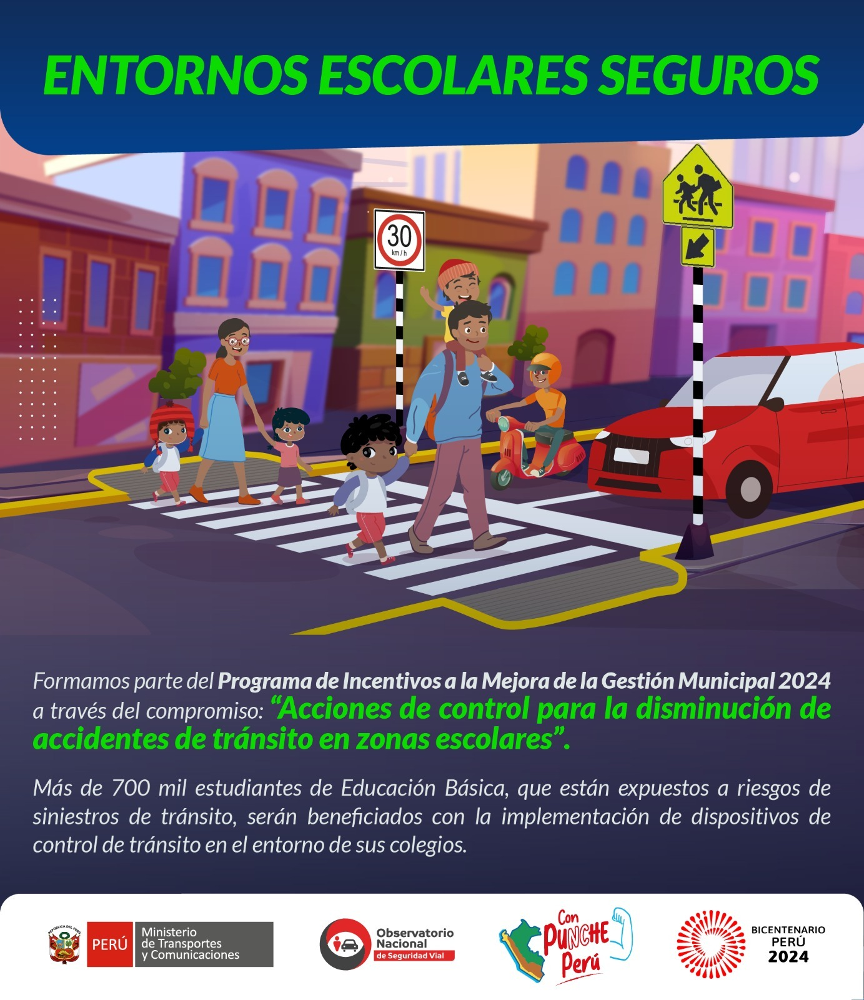

 

## Entornos Escolares Seguros Perú: Siniestralidad vial y proximidad a locales educativos

### [Documento de Trabajo 002](https://www.onsv.gob.pe:5000/siniestralidad-vial-e-infraestructura-segura-en-entornos-escolares/) del Observatorio Nacional de Seguridad Vial (ONSV)

## Resumen
Desde el MTC, la Dirección de Seguridad Vial promovió en el año 2022 el programa “Entornos Escolares Seguros”, con el objetivo de mejorar la seguridad
vial alrededor de locales educativos en el marco del Decreto Supremo
N° 025-2021-MTC. Como parte de este proyecto se realizó una intervención
piloto en la I.E. María Negrón Ugarte de Trujillo que benefició a 1200 alumnas.
Esta iniciativa representa un hito de trabajo en articulación con Transportes
Metropolitanos de Trujillo, la Municipalidad Provincial de Trujillo y el apoyo de la
empresa 3M.
 
A partir de esta experiencia, este tipo de proyectos se ha consolidado como un
servicio dentro de la Política Nacional Multisectorial de Seguridad Vial 2023 –
2030 (PNMSV), lo cual ha permitido iniciar su escalabilidad a nivel nacional en el
presente año. En específico, este servicio S 4.1.3. Asistencia para el diseño de
proyectos de Entornos Escolares Seguros, fiable para gobiernos locales está
alineado con el Objetivo Prioritario 4 de la PNMSV de Lograr las velocidades
seguras para la protección de las y los usuarios viales.
 
Para planificar de manera más eficiente los
mecanismos de asistencia técnica, se identificaron aquellos distritos que
contaban con al menos 3 zonas escolares con siniestros fatales. De este modo, se
seleccionaron 73 distritos a nivel nacional en los que la implementación de este
tipo de acciones es urgente, como muestra el siguiente mapa. Sin perjuicio de ello, la
Dirección de Seguridad Vial brinda asistencia técnica a todas las entidades
administradoras de las vías, de modo que las acciones de seguridad vial no tengan
únicamente un enfoque reactivo a la ocurrencia de siniestros de tránsito, sino
también proactivo en cumplimiento de los estándares nacional e internacionales.

> ***¿Cuáles son los tramos viales en los que los administradores de la vía pueden implementar medidas que tengan alto impacto en la reducción de la siniestralidad vial?***

## Resultados 

La metodología ha sido desarrollada en código R, de modo que pueda ser reproducible a medida que los datos de sinestros del ONSV son robustecidos. A la fecha, se han realizados dos etapas de análisis:

**- Procesamiento con datos del ONSV desde enero 2021 a diciembre de 2022:**

Los datos georreferenciados de siniestros fatales del 2021 al 2022 se encuentran publicados en la sección Datos Abiertos de la web del ONSV y pueden descargarse [aquí](https://www.onsv.gob.pe/datosabiertos). A partir del procesamiento de 2,246 siniestros fatales en la Red Vial Nacional como datos de entrada, se identificaron 83 clústeres o tramos de alta densidad de siniestros.

**- Procesamiento con datos del ONSV desde enero 2021 a julio de 2023:**

Los datos georreferenciados de siniestros fatales del año 2023 vienen siendo actualizados a través del Sistema de Registro de Siniestros de Tránsito (SRAT). Con fecha de cierre de julio de 2023, se han incorporado 903 nuevos registros, lo cual suma 3,149 siniestros fatales en la Red Vial Nacional como datos de entrada. Se identificaron 155 clústeres o tramos de alta densidad de siniestros, de los cuales 76 son resultado de la actualización de los datos. 

Estos instrumento se difunde como diagnóstico sobre el que los administradores deben iniciar la investigación particular de las condiciones de riesgo de la infraestructura y vial y, tomar acciones para garantizar la seguridad vial desde una perspectiva de Visión Cero y personas usuarias vulnerables.

**- Procesamiento con datos del ONSV desde enero 2021 a diciembre de 2023:**

Los datos georreferenciados de siniestros fatales del año 2023 vienen siendo actualizados a través del Sistema de Registro de Siniestros de Tránsito (SRAT). Con fecha de cierre de diciembre de 2023, se han incorporado 506 nuevos registros, lo cual suma 3,655 siniestros fatales en la Red Vial Nacional como datos de entrada. Se identificaron 210 clústeres o tramos de alta densidad de siniestros, de los cuales 55 son resultado de la actualización de los datos. 

Estos instrumento se difunde como diagnóstico sobre el que los administradores deben iniciar la investigación particular de las condiciones de riesgo de la infraestructura y vial y, tomar acciones para garantizar la seguridad vial desde una perspectiva de Visión Cero y personas usuarias vulnerables.

## Mapa Interactivo de clústeres o tramos de alta densidad de siniestros fatales

**Datos del ONSV de enero 2021 a diciembre de 2022:**

Los detalles de los 83 clústeres o tramos de alta siniestralidad identificados con datos de este período de datos pueden ser explorados en el [siguiente mapa interactivo](https://patriciaig.github.io/SeguridadVialPeru/mapa_tramos_alta_densidad_fatalidades.html).

**Datos del ONSV de enero 2021 a julio de 2023**
